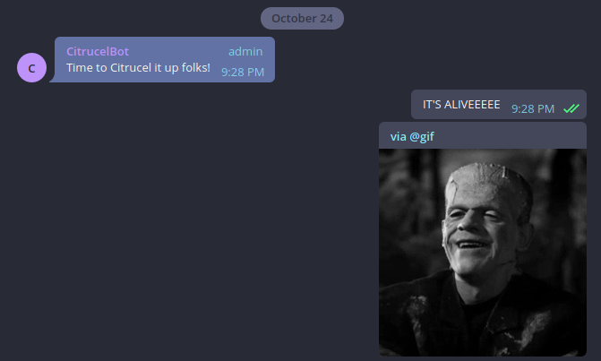

# CitrucelBot

A telegram bot for sending reminders to take Citrucel.

## Description

This is a very bare-bones bot in that it admits no interaction from a user and
basically runs as a cron job on GCP Cloud Scheduler that publishes to a GCP
Pub/Sub topic, which subsequently triggers a GCP Cloud Function that pushes a
task to a GCP Cloud Task queue. The task itself runs at a scheduled time that
hits the specified HTTP Telegram bot API endpoint.
